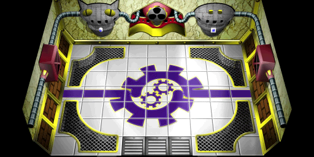
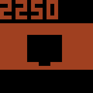

# DATA2000.BIN - [Back](../../home.md)

File containing background, texts, collision, effects, music and player position settings for each cities and places.

## Structure

| Offset | Type | Description |
|--------|------|-------------|
| 0x00   | uint32 | [Data Pointer](#data-pointer)

### Data Pointer

| Offset | Type | Description |
|--------|------|-------------|
| 0x00   | uint32 | Dummy Data
| 0x04   | uint32 | [Background LBA](#background-lba)
| 0x08   | uint32 | [Player Position](#player-position)
| 0x0C   | uint32 | [Player Transition](#player-transition)
| 0x10   | uint32 | [Scenario Collision](#scenario-collision)
| 0x14   | uint32 | BGM
| 0x18   | uint32 | [Metallic Footsteps](#metallic-footsteps)
| 0x1C   | uint32 | [Scenario Effects](#scenario-effects)
| 0x20   | uint32 | [Message LBA](#message-lba)

### Background LBA
This is the LBA string value from **_SLUS_011.93_** related to the **CITY/BG/BKxxxxST.BIN** file. That forms the background of the scenario, as shown in the image example from **_BK2250ST.BIN_**.
  

### Player Position
_Under Construction_.

### Player Transition
_Under Construction_.

### Scenario Collision
Position value of the scenario collision, which is actually defined through tiles with **_1bpp linear, reverse order_** formats, as shown in the image example below from Meditation Dome - left room linked to **_BK2250ST.BIN_**.
  

### Metallic Footsteps
Position value of the metallic footsteep collision, this is used to give the metallic sound when the player walks over metallic platforms, which is actually defined through tiles with **_1bpp linear, reverse order_** formats, as shown in the image example below from Meditation Dome - left room linked to **_BK2250ST.BIN_**.
  
### Scenario Effects
_Under Construction_.

### Message LBA
This is the LBA string value from **_SLUS_011.93_** related to the **CITY/MESS/MESSxxxx.BIN** file. It determines which text will be used in the scenario.
