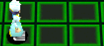

# MESSXXXX.BIN - [Back](../../home.md)

MESS files contain the text used by NPC's, text flow control and flags for when NPC's need to appear/disappear or dialogue needs to be advanced.

## Structure

| Offset | Type | Description |
|--------|------|-------------|
| 0x00   | uint32 | [Position Pointer](#position-pointer)
| 0x04   | uint32 | [Flag Pointer](#flag-pointer)
| 0x08   | uint32 | [Array Pointer](#array-pointer)

After the pointers, the texts always start from offset `0x0C` onwards.

## Position Pointer
This pointer sets the movement for the NPC, this can set NPCs in stand position or walking around.
* _You can only set a **maximum of 6 movement**, but if you set more than 4 positions, this cause a movement bugs._

| Offset | Type | Description |
|--------|------|-------------|
| 0x00   | uint8 | Movement 1 X-Coordinate
| 0x01   | uint8 | Movement 1 Y-Coordinate
| 0x02   | uint8 | Movement 2 X-Coordinate
| 0x03   | uint8 | Movement 2 Y-Coordinate
| 0x04   | uint8 | Movement 3 X-Coordinate
| 0x05   | uint8 | Movement 3 Y-Coordinate
| 0x06   | uint8 | Movement 4 X-Coordinate
| 0x07   | uint8 | Movement 4 Y-Coordinate
| 0x08   | uint8 | Null
| 0x0A   | uint8 | Null
| 0x0B   | uint8 | Null
| 0x0C   | uint8 | Null

### Stand Position Example
```
09 0B FF FF FF FF FF FF FF FF FF FF
```


----
### Walking Position Example
```
08 0B 0A 0B FF FF FF FF FF FF FF FF
```


## Flag Pointer
Define what will be activated during the dialogue with the NPC or Digimons, such as get bits, items, unlock story or domains, changing Digi-beetles, etc.<br>
* _Null Flags values is used as **FF FF**_

| Offset | Type | Description |
|--------|------|-------------|
| 0x00   | uint16 | [Flag 0 ID](../Dictionary/Flag.md)
| 0x02   | Boolean | [Flag 0 Activator](#flag-activator)
| 0x03   | uint8 | Dummy
| 0x04   | uint16 | [Flag 1 ID](../Dictionary/Flag.md)
| 0x06   | Boolean | [Flag 1 Activator](#flag-activator)
| 0x07   | uint8 | Dummy
| 0x08   | uint16 | [Flag 2 ID](../Dictionary/Flag.md)
| 0x0A   | Boolean | [Flag 2 Activator](#flag-activator)
| 0x0B   | uint8 | Dummy
| 0x0C   | uint16 | [Flag 3 ID](../Dictionary/Flag.md)
| 0x0D   | Boolean | [Flag 3 Activator](#flag-activator)
| 0x0E   | uint8 | Dummy
| 0x10   | uint16 | [Flag 4 ID](../Dictionary/Flag.md)
| 0x12   | Boolean | [Flag 4 Activator](#flag-activator)
| 0x13   | uint8 | Dummy
| 0x14   | uint16 | [Flag 5 ID](../Dictionary/Flag.md)
| 0x16   | Boolean | [Flag 5 Activator](#flag-activator)
| 0x17   | uint8 | Dummy

### Flag Example
```
E9 03 01 00 E7 05 01 00 FF FF FF FF FF FF FF FF FF FF FF FF FF FF FF FF = Check
FF FF FF FF FF FF FF FF FF FF FF FF FF FF FF FF FF FF FF FF FF FF FF FF = Set
```

### Flag Activator

| ID | Description |
|--------|------|
| 0x00   | False |
| 0x01   | True |

## Array Pointer
Defines the model of the NPC or Digimon that will be used in the dialog and choose which flag and text will be activated.
* _You can only set a **maximum of 6** check flags, set flags and texts to be triggered per NPC or Digimon._

| Offset | Type | Description |Notes|
|--------|------|-------------|-----|
| 0x00   | uint16 | Model ID |Model used in the dialog
| 0x02   | uint8 | [Rotation](https://gledson999.github.io/opendw2/DMW2/CITY/DATA2000.html#rotation-id) |Uses the same DATA2000 RotationID rules
| 0x03   | uint8 | Dummy |Always set to 00
| 0x04   | uint8 | Position ID |ID to be looked up in the Position Pointer
| 0x05   | uint8 | Visibility |ID to be looked up in the Flags Pointer
| 0x06   | uint8 | Check Flag ID 0 |**_Check flag_**_, looked up in the Flags Pointer_
| 0x07   | uint8 | Check Flag ID 1 |**_Check flag_**_, looked up in the Flags Pointer_
| 0x08   | uint8 | Check Flag ID 2 |**_Check flag_**_, looked up in the Flags Pointer_
| 0x09   | uint8 | Check Flag ID 3 |**_Check flag_**_, looked up in the Flags Pointer_
| 0x0A   | uint8 | Check Flag ID 4 |**_Check flag_**_, looked up in the Flags Pointer_
| 0x0B   | uint8 | Check Flag ID 5 |**_Check flag_**_, looked up in the Flags Pointer_
| 0x0C   | uint8 | Set Flag ID 0 |**_Set flag_**_, looked up in the Flags Pointer_
| 0x0D   | uint8 | Set Flag ID 1 |**_Set flag_**_, looked up in the Flags Pointer_
| 0x0E   | uint8 | Set Flag ID 2 |**_Set flag_**_, looked up in the Flags Pointer_
| 0x0F   | uint8 | Set Flag ID 3 |**_Set flag_**_, looked up in the Flags Pointer_
| 0x10   | uint8 | Set Flag ID 4 |**_Set flag_**_, looked up in the Flags Pointer_
| 0x11   | uint8 | Set Flag ID 5 |**_Set flag_**_, looked up in the Flags Pointer_
| 0x12   | uint16 | Dummy|Always set to 00
| 0x14   | uint32 | Text pointer |Display text when flag criteria from Check flag ID 0 are met
| 0x18   | uint32 | Text pointer |Display text when flag criteria from Check flag ID 1 are met
| 0x1C   | uint32 | Text pointer |Display text when flag criteria from Check flag ID 2 are met
| 0x20   | uint32 | Text pointer |Display text when flag criteria from Check flag ID 3 are met
| 0x24   | uint32 | Text pointer |Display text when flag criteria from Check flag ID 4 are met
| 0x28   | uint32 | Text pointer |Display text when flag criteria from Check flag ID 5 are met

* Special thanks to [RemyRM](https://github.com/RemyRM) and [Grensuingo](https://github.com/Grensuingo) for the information and documentation about the MESS files.
