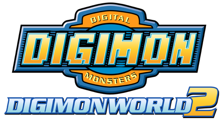

# Introduction
This repository was created with the purpose of gathering information related to reverse engineering and modding of Digimon World 2.

Most of the information relayed in this document is the collective effort of a lot of people active within the Digimon World 2 community and Discord, and cannot be contributed to a single person.

## Files Types
- [x] [ENEMYSET.BIN](./DMW2/DATAFILE/ENEMYSET.md)
- [ ] [DATA2000.BIN](./DMW2/CITY/DATA2000.md)

## Dictionary List
- [x] [Digimon ID](./DMW2/Dictionary/Digimon.md)
- [x] [Item ID](./DMW2/Dictionary/Item.md)
- [x] [Tech ID](./DMW2/Dictionary/Tech.md)
- [x] [Flag ID](./DMW2/Dictionary/Flag.md)
- [ ] [Screen List](./DMW2/Dictionary/Screen.md)

## Modding Releases
* [Digimon World 2 - Improvement Hack](https://www.romhacking.net/hacks/2587/)
* [Digimon World 2 - Faithful Mode](https://www.romhacking.net/hacks/7540/)
* [Digimon World 2 - Alternative](https://www.romhacking.net/hacks/7272/)
* [Digimon World 2 - Hardmode](https://www.romhacking.net/hacks/5358/)

## Tool Releases
* [Digimon World 2 - Digivolution Visualizer](https://www.romhacking.net/utilities/1727/)
* [Digimon World 2 - Tiny Tool](https://www.romhacking.net/utilities/1723)

## Other resources!

* Luminaires [Google Sheet Pages](https://docs.google.com/spreadsheets/d/1UiDU4MsSfxO1vhpK6err1KsLRZM53JUOuYqYhfEFp8o/edit#gid=1090520331).
* Excel sheet containing all the [tables found in this repo](https://onedrive.live.com/view.aspx?resid=B76DE694BAB9BB32!1990&ithint=file%2cxlsx&authkey=!AH_tXa42X9h_zBY )
* Gamefaqs thread about [DW2 modding](https://gamefaqs.gamespot.com/boards/437339-digimon-world-2/77216807)
* Discord invite [Link](https://discord.gg/EKkaFQG)

